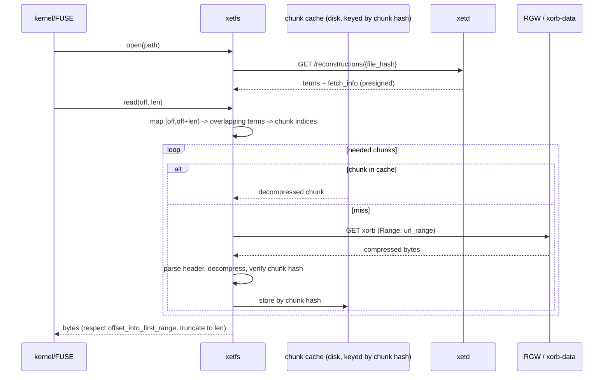

# `xetd`: A Self-Hosted Xet CAS Server with a Reconstructing VFS

**Implementation Specification — Draft v0.1**

Status: design draft for implementation. Working names `xetd` (server daemon), `xet-agent` (client/ingest library), `xetfs` (FUSE mount) are placeholders.

This document specifies a self-hostable storage system that speaks the **Xet protocol** so that any conforming Xet client (including Hugging Face's stock `hf-xet`) can talk to it, and that additionally provides a POSIX virtual filesystem of files reconstructed on demand from chunk-deduplicated storage.

It conforms to the `XET-BLAKE3-GEARHASH-LZ4` algorithm suite as defined in the Xet Protocol Specification (IETF `draft-denis-xet`, and the Hugging Face Xet docs). This spec does **not** restate the protocol in full; it specifies the *server and VFS* on top of it and references the protocol for wire formats. Where a number, key, or rule is load-bearing for interop it is restated inline for convenience.

---

## 1. Goals and non-goals

### 1.1 Goals

1. **Wire-compatible Xet CAS server.** Implement the four CAS endpoints (reconstruction, global chunk dedup, xorb upload, shard upload) so an unmodified Xet client can upload and download.
2. **Upload only new data.** Re-storing a file that shares content with data already on the server must transfer only the novel chunks. This is achieved with two cooperating layers: client-side deduplication (local session cache, local shard cache, and the global dedup API) and server-side xorb existence checks.
3. **Reconstructing virtual filesystem.** Mount a directory tree (`xetfs`) whose files are materialized on read from xorbs, with a decompressed-chunk cache so repeated/overlapping reads are cheap. Writes (optional, later phase) are chunked, deduplicated, and ingested on close.
4. **User mode only.** No kernel modules. The VFS is implemented over FUSE; the server is an ordinary userspace HTTP daemon.
5. **Pluggable object backend.** A `BlobStore` abstraction with a local-filesystem implementation first, and an S3-compatible implementation (targeting **Ceph RADOS Gateway / RGW**) as a drop-in second backend.

### 1.2 Non-goals (initially)

- Git / Git-LFS bridge, Hugging Face Hub repo semantics, gated/access-controlled content, and CDN integration.
- Horizontal scale-out and HA. The first target is a single node (optionally with remote clients).
- Cross-region replication, multi-tenant quotas, billing.

These are explicitly deferred; the architecture leaves room for them (the `BlobStore` and auth layers are the natural seams).

---

## 2. Protocol primer (the parts the server must honor)

You do not need to invent any of the data-plane formats; they are fixed by the suite. The server's job is to *store, index, and serve* these objects and to *answer dedup queries*.

- **Chunk.** Variable-sized slice of a file produced by content-defined chunking (Gearhash). Identified by a 32-byte BLAKE3 keyed hash.
- **Xorb** ("Xet orb"). A container aggregating many compressed chunks. Max **64 MiB** serialized, max **8192 chunks**, target ~1024 chunks. Identified by a Merkle-style hash over its chunk hashes.
- **Shard.** Binary metadata describing one or more *file reconstructions* (ordered lists of terms) and/or *CAS info* (which chunks live in which xorbs). Uploaded **without** its 200-byte footer; stored **with** a footer.
- **Term.** `(xorb_hash, [chunk_start, chunk_end), unpacked_length)` — a contiguous run of chunks inside one xorb. A file is an ordered list of terms.
- **File hash.** Content address of a whole file (Merkle root over chunk hashes, plus a final keyed hash). This is the key the reconstruction API is queried by.

### 2.1 Algorithm suite constants (restated for convenience)

```
Suite:               XET-BLAKE3-GEARHASH-LZ4
Hash:                BLAKE3 keyed, 32-byte outputs
Chunker:             Gearhash rolling hash (256-entry 64-bit table)
TARGET_CHUNK_SIZE    = 65536      (64 KiB)
MIN_CHUNK_SIZE       = 8192       (8 KiB)
MAX_CHUNK_SIZE       = 131072     (128 KiB)
MASK                 = 0xFFFF000000000000
MAX_XORB_SIZE        = 67108864   (64 MiB)
MAX_XORB_CHUNKS      = 8192
```

BLAKE3 domain-separation keys (32 bytes each):

| Purpose | Key name | Notes |
|---|---|---|
| Chunk hash | `DATA_KEY` | `keyed_hash(DATA_KEY, chunk_bytes)` |
| Merkle internal node | `INTERNAL_NODE_KEY` | input is `"{hash_hex} : {size}\n"` per child |
| File hash final step | `ZERO_KEY` (all zero) | `keyed_hash(ZERO_KEY, merkle_root)` |
| Term verification | `VERIFICATION_KEY` | input is raw concatenation of chunk hashes |

The exact key byte values, the 256-entry Gearhash table, the byte-swapped hash **string** representation, the Merkle "aggregated hash tree" cut-point rule (mean branching factor 4), and the xorb/shard byte layouts are in the protocol spec. **Reuse a library for these rather than re-deriving them** (see §13).

### 2.2 Global-deduplication eligibility (load-bearing rule)

A chunk is eligible to be advertised in / queried against the global dedup index iff:

1. it is the **first chunk of a file**, **or**
2. the **last 8 bytes of its chunk hash**, read as a little-endian `u64`, satisfy `value % 1024 == 0`.

The client sets bit 31 (`GLOBAL_DEDUP_ELIGIBLE`) on the chunk's `CASChunkSequenceEntry` in the shard it uploads. **The server's global index is populated exactly from those flagged chunks** (see §6.3). This keeps the index ~1/1024 the size of the full chunk population while still letting clients find long shared runs.

---

## 3. System architecture

```mermaid
flowchart TB
  subgraph client[Client host]
    FS[xetfs FUSE mount]
    AG[xet-agent: chunk / hash / dedup / (de)serialize]
    CC[(decompressed-chunk cache)]
    SC[(local shard cache)]
    FS --> AG
    AG --> CC
    AG --> SC
  end

  subgraph server[xetd server]
    API[HTTP API: reconstruction / chunks / xorbs / shards / token]
    IDX[(metadata + index store: SQLite or RocksDB)]
    BS[BlobStore trait]
    API --> IDX
    API --> BS
  end

  subgraph backend[Object backend]
    LFS[local filesystem]
    RGW[(Ceph RGW / S3)]
  end

  AG <-->|HTTPS, bearer token| API
  BS --> LFS
  BS --> RGW
  AG -. presigned GET (xorb byte ranges) .-> RGW
```

### 3.1 Components

- **`xetd` (server).** Stateless request handlers over two stores: the **index** (metadata, mutable) and the **`BlobStore`** (xorb bytes, immutable). Implements the CAS API plus a token endpoint.
- **`BlobStore`.** Trait abstracting object persistence. Implementations: `local-fs`, `s3` (Ceph RGW). See §5.
- **Index store.** Embedded DB holding the xorb catalog, the global chunk index, stored shards, and the **VFS catalog** (path → file mapping). See §6.
- **`xet-agent` (client lib).** The upload/download pipeline: chunking, hashing, the three-tier dedup, xorb/shard (de)serialization, range fetches, decompression, verification. May be the existing `xet-core` crates pointed at `xetd`, or a thin reimplementation that reuses `xet-core`'s format crates.
- **`xetfs` (FUSE mount).** Presents the VFS; uses `xet-agent` for the data path. See §9.

### 3.2 Deployment topologies

- **All-in-one (recommended first):** `xetd` + `xetfs` on one host, backend = local FS, loopback HTTP, auth disabled or static token. This already delivers chunk-dedup self-hosted storage with a mountable FS.
- **Server + remote clients:** `xetd` on a storage node (backend = local FS or RGW), clients mount `xetfs` over the network. Requires TLS + tokens.
- **Server + Ceph:** `xetd` stateless (can run >1 replica behind a load balancer if the index is externalized), backend = RGW. The hot path (xorb byte fetches) goes **client → presigned URL → RGW directly**, so `xetd` is off the bulk data path.

---

## 4. CAS server API

Transport: HTTP/1.1 or H2 over TLS. Binary bodies use `application/octet-stream`. The URL shapes below follow the protocol's recommended API; you MAY change paths but SHOULD keep these so stock clients work unmodified.

### 4.1 Authentication and the token endpoint

Stock Xet clients first ask the *hub* for a short-lived Xet token and a CAS URL, then call the CAS service with that token. To be drop-in, `xetd` exposes a minimal token endpoint:

```
GET /api/{namespace}/xet-read-token/{ref}
GET /api/{namespace}/xet-write-token/{ref}
Authorization: Bearer <user-or-api-token>      # or omitted in trusted-loopback mode

200 OK
{ "accessToken": "<jwt>", "exp": <unix_secs>, "casUrl": "https://this-host" }
```

- **Scopes:** `read` (reconstruction + global dedup), `write` (xorb + shard upload; implies read).
- **Self-host modes:** (a) **trusted loopback** — auth disabled, every request is full-scope (single-user laptop/NAS); (b) **static tokens** — one or more configured API tokens mapped to scopes; (c) **OIDC / reverse-proxy** — `xetd` trusts an upstream proxy's identity header. The data-plane endpoints below validate the issued `accessToken` (a signed JWT with scope + expiry).

All tokens MUST be sent only over TLS and MUST NOT be logged.

### 4.2 `GET /api/v1/reconstructions/{file_hash}`

Return the reconstruction for a file. Optional `Range: bytes={start}-{end}` for partial reconstruction.

```jsonc
200 OK
{
  "offset_into_first_range": 0,            // bytes to skip in the first term (range queries)
  "terms": [
    { "hash": "<xorb_hash_hex>", "unpacked_length": 263873, "range": { "start": 0, "end": 4 } }
  ],
  "fetch_info": {
    "<xorb_hash_hex>": [
      { "range": { "start": 0, "end": 4 },           // chunk-index range, end-exclusive
        "url": "https://...",                          // presigned, ephemeral
        "url_range": { "start": 0, "end": 131071 } }   // BYTE range, end-INCLUSIVE (HTTP semantics)
    ]
  }
}
```

Server logic:

1. Resolve `file_hash` → stored shard (404 if unknown).
2. Emit the shard's file-reconstruction terms in order.
3. For each referenced xorb and chunk-index range, translate to a **byte range** within the serialized xorb using the xorb's stored chunk-boundary offsets (§6.2), and produce a presigned `url` + `url_range` for that byte span (§5.4).
4. For range requests, return only overlapping terms and set `offset_into_first_range`.

Errors: `400` bad hash, `401` unauth, `404` unknown file, `416` bad range. Responses are ephemeral: `Cache-Control: private, no-store` (they embed expiring URLs).

> **Note on `range` vs `url_range`.** Chunk-index ranges are end-**exclusive** `[start, end)`. `url_range` is an HTTP byte range and is end-**inclusive**. Do not conflate them.

### 4.3 `GET /api/v1/chunks/{namespace}/{chunk_hash}` (global dedup)

Check whether a chunk is known globally.

- **`200 OK`** → body is a **shard** (binary) with an **empty File Info section** and a CAS Info section listing the xorb(s) containing the chunk. Chunk hashes in this response are **keyed** (HMAC-style) with the shard footer's `chunk_hash_key`; the client must recompute `keyed_hash(key, local_chunk_hash)` to match. Footer carries `chunk_hash_key` + `shard_key_expiry`.
- **`404 Not Found`** → chunk not in the global index.
- Suggested header on hits: `Cache-Control: private, max-age=3600`, `Vary: Authorization`.

`namespace` selects a dedup domain (e.g. `default-merkledb`). Most self-host deployments use a single namespace.

### 4.4 `POST /api/v1/xorbs/{namespace}/{xorb_hash}`

Upload a serialized xorb. Body is the xorb binary.

The server **MUST**:

1. Enforce size limits (`≤ MAX_XORB_SIZE`, `≤ MAX_XORB_CHUNKS`).
2. Parse the `CasObjectInfo` footer; **recompute the Merkle root** over the chunk hashes and verify it equals `{xorb_hash}` (reject `400` on mismatch — this is the integrity gate).
3. Validate each chunk header (version `0`, sane compressed/uncompressed sizes ≤ 128 KiB).
4. If the xorb already exists, return `was_inserted: false` (not an error — idempotent). Otherwise persist bytes to the `BlobStore` and index it (§6.2).

```json
200 OK
{ "was_inserted": true }
```

Errors: `400` hash/format, `401` unauth, `403` scope.

### 4.5 `POST /api/v1/shards`

Register files/xorbs. Body is a shard **without footer**.

The server **MUST**:

1. Verify the magic sequence (and optionally the application id).
2. For every xorb referenced by any term, confirm it has already been uploaded (`400` if a referenced xorb is missing — enforces the ordering constraint).
3. Optionally verify term **verification hashes** to confirm the uploader actually possesses the data (recommended; this is what `VERIFICATION_KEY` is for).
4. Store the shard (synthesize and append a footer for local storage), index `file_hash → shard`, index each xorb's CAS info, and insert each `GLOBAL_DEDUP_ELIGIBLE` chunk into the global index (§6.3).

```json
200 OK
{ "result": 1 }      // 0 = shard already existed, 1 = registered
```

Errors: `400` format / missing referenced xorb, `401` unauth, `403` scope.

### 4.6 Local-backend byte serving (when not using S3)

With `local-fs`, there is no cloud presigner. `xetd` serves xorb ranges itself and presigns with its own short-lived HMAC:

```
GET /api/v1/xorb-data/{xorb_hash}?exp=<ts>&sig=<hmac>
Range: bytes=<start>-<end>     # end inclusive
206 Partial Content
Cache-Control: public, immutable, max-age=<= (exp - now)
ETag: "<xorb_hash>"
```

`reconstructions` then emits these URLs in `fetch_info`. With `s3`, emit RGW presigned URLs instead (§5.4). The client code path is identical (it just does a ranged GET).

---

## 5. Storage backend abstraction (`BlobStore`)

Xorbs are immutable and content-addressed, which makes the backend contract small.

### 5.1 Trait (Rust sketch)

```rust
#[async_trait]
pub trait BlobStore: Send + Sync {
    /// Idempotent write of a complete xorb. Returns false if it already existed.
    async fn put_xorb(&self, key: &XorbKey, bytes: Bytes) -> Result<bool>;

    /// Existence / size without fetching the body.
    async fn head_xorb(&self, key: &XorbKey) -> Result<Option<ObjectMeta>>;

    /// Ranged read (inclusive byte range), used by the local serving path.
    async fn get_xorb_range(&self, key: &XorbKey, range: ByteRange) -> Result<Bytes>;

    /// Produce a time-limited URL a client can GET directly (with a Range header).
    /// local-fs returns an xetd-signed URL; s3 returns an RGW presigned URL.
    async fn presign_get(&self, key: &XorbKey, ttl: Duration) -> Result<Url>;

    /// Delete (GC only). Must be safe to call on a missing key.
    async fn delete_xorb(&self, key: &XorbKey) -> Result<()>;
}
```

Shards MAY be stored in the index DB (they are small) rather than the `BlobStore`.

### 5.2 Object key layout (content-addressed, fanned-out)

```
xorbs/<suite>/<namespace>/<h0h1>/<h2h3>/<xorb_hash_hex>
        |        |           |       |        |
        |        |           |       |        +-- 64-char XET-string hash
        |        |           |       +----------- next 2 hex chars (fan-out)
        |        |           +------------------- first 2 hex chars (fan-out)
        |        +------------------------------- dedup/storage namespace
        +---------------------------------------- "xet-blake3-gearhash-lz4"
```

Two-level hex fan-out avoids hot prefixes/huge directories. Keys are immutable; no overwrites except identical-content idempotent puts.

### 5.3 Local-FS implementation

- `put_xorb`: write to a temp file in the same directory, `fsync`, atomic `rename` to the final key (crash-safe, idempotent).
- `get_xorb_range`: `pread` the requested span.
- `presign_get`: return `…/api/v1/xorb-data/{hash}?exp&sig` (§4.6).
- Recommended on Linux: a filesystem that itself does block-level dedup/compression (e.g. ZFS/btrfs) is complementary but **not** required — Xet already deduplicates at the chunk level above the FS.

### 5.4 S3 / Ceph RGW implementation

- Use an S3 SDK (e.g. `aws-sdk-s3`) pointed at the RGW endpoint; **path-style addressing** (`http://rgw-host/bucket/key`) is the safe default for RGW.
- `put_xorb`: single `PutObject` (xorbs are ≤64 MiB, so multipart is unnecessary). Set `If-None-Match: *` if you want server-side idempotency, or rely on content addressing.
- `presign_get`: SigV4 **presigned GET** with TTL = the reconstruction URL lifetime. The client appends a `Range` header at fetch time; the presign covers the object, not a fixed range, so one presigned URL serves any byte span.
- **TTL/caching alignment:** the reconstruction response and any cache headers MUST NOT outlive the presigned URL. If a URL is valid 900 s, do not advertise `max-age` > 900.
- RGW provides read-after-write consistency for new objects, which suits content-addressed immutable writes.
- **Ceph pool note (informative):** xorbs are medium objects (≤64 MiB). Erasure-coded pools give better storage efficiency; replicated pools give simpler/faster small-object behavior. This is a Ceph-side choice and is outside `xetd`, but it affects effective cost of the dedup'd footprint.

---

## 6. Metadata and index store

Single embedded store. **SQLite (WAL mode)** is recommended for a single node (simple, transactional, easy backup); **RocksDB** if write throughput dominates. Externalize to Postgres only if you run multiple `xetd` replicas.

### 6.1 What must be tracked

1. **Xorb catalog** — every stored xorb, its size, chunk count, backend key, and per-chunk boundary offsets (to translate chunk ranges → byte ranges for `fetch_info`).
2. **Global chunk index** — for `GLOBAL_DEDUP_ELIGIBLE` chunks: `chunk_hash → (xorb_hash, chunk_index, …)`.
3. **Shards / files** — `file_hash → shard bytes` (+ enough to emit terms quickly).
4. **VFS catalog** — `path → file entry` (this is the bridge from hash-addressed CAS to a named tree; see §9.1).

### 6.2 Xorb index — boundary offsets matter

On xorb upload, parse the footer's **boundary section** and persist, per chunk: the **compressed end offset** (byte position in the serialized xorb) and the **uncompressed end offset**. Reconstruction uses the compressed offsets to compute the `url_range` for a term's `[chunk_start, chunk_end)`:

```
byte_start = chunk_start == 0 ? 0 : compressed_end_offset[chunk_start - 1]
byte_end   = compressed_end_offset[chunk_end - 1] - 1     // inclusive
```

You may store these as a compact `BLOB` (array of `u32`) on the xorb row rather than one row per chunk.

### 6.3 Global chunk index — population and keying

- On **shard upload**, for each `CASChunkSequenceEntry` with bit 31 set, upsert `chunk_hash → (xorb_hash, chunk_index, unpacked_len)`.
- The index stores **raw** chunk hashes. At **query time**, the server computes the keyed hash with the **current rotating key** when building the response shard, and writes that key + its `shard_key_expiry` into the response footer. This is what lets the client match without the server ever revealing raw hashes to parties who don't already have the data.
- **Key rotation:** keep an active `chunk_hash_key` plus a short grace window of previous keys. Rotate on a schedule (e.g. daily/weekly). Single-user deployments MAY set `chunk_hash_key = 0` (no keying) to simplify — privacy keying only matters across mutually-distrusting users.

### 6.4 Schema (SQLite DDL sketch)

```sql
CREATE TABLE xorbs (
  xorb_hash      BLOB PRIMARY KEY,      -- 32 bytes (raw)
  namespace      TEXT NOT NULL,
  size_on_disk   INTEGER NOT NULL,
  num_chunks     INTEGER NOT NULL,
  backend_key    TEXT NOT NULL,
  comp_offsets   BLOB NOT NULL,         -- u32[num_chunks], compressed end offsets
  uncomp_offsets BLOB NOT NULL,         -- u32[num_chunks], uncompressed end offsets
  created_at     INTEGER NOT NULL
);

CREATE TABLE chunk_index (              -- global dedup (eligible chunks only)
  chunk_hash   BLOB PRIMARY KEY,        -- raw 32 bytes
  xorb_hash    BLOB NOT NULL REFERENCES xorbs(xorb_hash),
  chunk_index  INTEGER NOT NULL,
  unpacked_len INTEGER NOT NULL
);

CREATE TABLE files (
  file_hash   BLOB PRIMARY KEY,         -- raw 32 bytes
  shard_id    INTEGER NOT NULL REFERENCES shards(id),
  total_size  INTEGER NOT NULL,
  created_at  INTEGER NOT NULL
);

CREATE TABLE shards (
  id          INTEGER PRIMARY KEY,
  shard_hash  BLOB UNIQUE,
  bytes       BLOB NOT NULL             -- stored WITH footer
);

-- VFS catalog: the name<->hash bridge (see §9.1)
CREATE TABLE volumes ( id INTEGER PRIMARY KEY, name TEXT UNIQUE NOT NULL );
CREATE TABLE entries (
  volume_id  INTEGER NOT NULL REFERENCES volumes(id),
  path       TEXT NOT NULL,             -- POSIX path within the volume
  kind       INTEGER NOT NULL,          -- 0=file 1=dir 2=symlink
  file_hash  BLOB,                      -- NULL for dirs
  size       INTEGER NOT NULL DEFAULT 0,
  mode       INTEGER NOT NULL,
  mtime_ns   INTEGER NOT NULL,
  target     TEXT,                      -- symlink target
  PRIMARY KEY (volume_id, path)
);

-- Reference counts for GC (see §11)
CREATE TABLE xorb_refs ( xorb_hash BLOB PRIMARY KEY, refcount INTEGER NOT NULL );
```

---

## 7. Deduplication: how "only new data uploads" actually works

Two cooperating layers. Both are needed: the client layer avoids *transferring* known data; the server layer avoids *storing* duplicate data even if a client re-sends it.

### 7.1 Client-side (the important one) — three tiers, checked in order

1. **Local session.** Within one ingest, track seen chunk hashes; never process the same chunk twice.
2. **Local shard cache.** Persisted shards from recent uploads enable matching against recently-seen content with **no network round-trip**.
3. **Global dedup API.** For *eligible* chunks (§2.2) not matched locally, `GET /chunks/{ns}/{hash}`. On a hit, the returned (keyed) shard tells the client which existing xorb the chunk lives in, so the client can reference it in a term instead of re-uploading. A single eligible-chunk hit typically unlocks a long contiguous run (the shard advertises neighbors), so one query can dedup many chunks.

Only chunks that miss all three tiers are packed into new xorbs and uploaded.

### 7.2 Server-side

`PUT /xorbs` is idempotent: if the xorb hash already exists, the body is discarded and `was_inserted=false`. This is a backstop (it still cost a transfer); the client tiers are what avoid the transfer.

### 7.3 Fragmentation control

Maximizing dedup can scatter a file across hundreds of xorbs, hurting reconstruction throughput. The client SHOULD require a **minimum dedup run** (e.g. ≥ 8 chunks or ≥ 1 MiB) before accepting a deduplicated reference, preferring a slightly larger upload over a badly fragmented file. The server MAY also reject pathologically fragmented shards.

```mermaid
sequenceDiagram
  participant C as xet-agent
  participant S as xetd
  C->>C: chunk file (gearhash), hash chunks (BLAKE3/DATA_KEY)
  C->>C: tier1 session + tier2 local shard cache
  loop eligible chunks still unknown
    C->>S: GET /chunks/{ns}/{hash}
    S-->>C: 200 keyed shard (existing xorb refs) | 404
  end
  C->>C: form xorbs from remaining NEW chunks
  loop each new xorb
    C->>S: POST /xorbs/{ns}/{xorb_hash}
    S->>S: recompute merkle root == xorb_hash? store; index boundaries
    S-->>C: {was_inserted}
  end
  C->>C: build terms (new xorbs + deduped refs); verification hashes; file hash
  C->>S: POST /shards (no footer)
  S->>S: check referenced xorbs exist; verify; index file+CAS+global-eligible chunks
  S-->>C: {result}
```

---

## 8. Upload and download flows (server perspective)

### 8.1 Upload (ingest)

Performed by `xet-agent` per §7/§11 of the protocol; the server's responsibilities are the validation/indexing in §4.4 and §4.5. Ordering invariant: **all xorbs referenced by a shard must be uploaded before that shard.**

### 8.2 Download (reconstruct)

1. `GET /reconstructions/{file_hash}` → terms + per-xorb `fetch_info` (presigned ranged URLs).
2. Client fetches xorb byte ranges (directly from RGW when using S3; from `xetd`'s `xorb-data` endpoint when local), honoring `url_range`.
3. Parse chunk headers, decompress (`None`/`LZ4`/`ByteGrouping4LZ4`), extract the term's chunk range.
4. Skip `offset_into_first_range` on the first term; concatenate; for range queries truncate to the requested length.
5. SHOULD verify reconstructed bytes against the file hash when feasible.

---

## 9. The reconstructing VFS (`xetfs`)

### 9.1 The catalog: the missing piece between CAS and a filesystem

**Critical design point.** A Xet CAS is addressed by *content hashes*. It has **no concept of filenames, directories, permissions, or mtimes**. A POSIX filesystem is addressed by *names*. Therefore the VFS needs a **catalog/manifest layer** mapping `path → (file_hash, size, mode, mtime, …)`. This layer is **your** design — it is not part of the Xet protocol — and it is the thing that turns "a pile of deduplicated blobs" into "a mountable tree."

This spec models it as **volumes** of **entries** (§6.4 `volumes`/`entries`). Design choices you own:

- **Mutability model.** Simplest: a mutable per-volume table (a write updates the row's `file_hash`). More powerful: an immutable, versioned, git-like commit graph (each commit is itself a Xet-stored object), giving snapshots/rollback for free. Start mutable; the schema leaves room to add a `commits` table later.
- **Granularity.** One volume per "dataset"/"share", or a single global volume. Volumes are cheap.

### 9.2 Mount and inode model

- Use a userspace FUSE binding. In Rust, the **`fuser`** crate (low-level FUSE) pairs naturally with the Rust `xet-core` data path. Linux uses `/dev/fuse`; macOS uses macFUSE. (FUSE is precisely the "user mode" requirement — no kernel module of your own.)
- Map each catalog entry to a stable inode. `lookup`/`getattr`/`readdir` are served entirely from the catalog (fast, no CAS access). `open` on a file resolves `file_hash` and fetches its reconstruction (terms + `fetch_info`), caching it for the handle's lifetime (and briefly beyond — but note presigned URLs expire, so refresh on demand).

### 9.3 Read path



- **Decompressed-chunk cache** keyed by chunk hash is the performance workhorse: it is content-addressed and **immutable**, so it is shared across files, handles, and sessions and never needs invalidation. Bound it with size-aware LRU.
- **Readahead:** when a read touches a term, prefetch the rest of that term's contiguous xorb byte span in one ranged GET (you usually have to fetch the whole compressed chunk anyway).
- **Reconstruction cache:** keep the terms (cheap) but treat `fetch_info` URLs as ephemeral; re-query `/reconstructions` when a URL is near expiry.

### 9.4 Write path (later phase; optional)

Two strategies:

- **(a) Read-only mount + out-of-band ingest CLI (recommended first).** `xetfs` is read-only; a separate `xet-agent ingest <path> --volume V --as /dest` chunks, dedups, uploads, and updates the catalog. Zero FUSE write complexity; covers the "back up / publish into the dedup store, then mount and read" workflow.
- **(b) Writable mount with write-back-on-close.** Buffer writes for an inode to a local staging file (the FS page cache + a scratch file). On `release`/`fsync` of a *modified* file, run the full ingest pipeline on the staging bytes, compute the new `file_hash`, update the catalog entry, and adjust GC refcounts. Caveats to handle explicitly:
  - Chunking/hashing happens at **close**, not per write — so large-file closes are CPU/IO heavy. Only ingest if the file was actually written. Consider background ingest with a "dirty until durable" flag.
  - `rename`, `truncate`, partial overwrites, and `O_APPEND` all map to "edit staging file, re-ingest on close." Re-chunking is cheap relative to upload because dedup means only changed regions transfer.
  - Concurrent writers to one file: serialize per inode.

### 9.5 Caching/consistency summary

| Cached thing | Key | Mutable? | Invalidation |
|---|---|---|---|
| Decompressed chunk | chunk hash | no | never (content-addressed) |
| Raw xorb byte range | xorb hash + range | no | never (but bounded by space) |
| Reconstruction terms | file hash | no | never |
| `fetch_info` presigned URLs | — | yes (expire) | TTL; re-query |
| Catalog entry | volume+path | **yes** | the only thing that changes; update on write |

---

## 10. Ceph / S3 integration checklist

Even though S3 is a "future" backend, design the seams now so it drops in:

- [ ] All persistence goes through `BlobStore`; no direct filesystem calls in handlers.
- [ ] Reconstruction emits presigned ranged URLs from `BlobStore::presign_get`; the client never assumes the bytes come from `xetd`.
- [ ] Hash-addressed, fanned-out keys (§5.2) — works identically for FS paths and S3 keys.
- [ ] RGW endpoint config: URL, region (any string RGW accepts), access/secret keys, **path-style** addressing, bucket name(s).
- [ ] Presigned URL TTL ≤ token/reconstruction lifetime, and `Cache-Control: max-age` ≤ URL TTL.
- [ ] Verify RGW read-after-write for new objects (default) so a just-uploaded xorb is immediately reconstructable.
- [ ] (Optional) front xorb GETs with a CDN/cache later; keys are immutable so cache keys are stable.

---

## 11. Garbage collection and integrity

### 11.1 GC (xorbs are shared, so deletion is non-trivial)

- **Reference counting (recommended for online GC).** On shard insert, increment `xorb_refs` for each referenced xorb; on catalog entry delete/overwrite, walk the old file's shard and decrement. A xorb at refcount 0 is a deletion candidate. Use a grace period before physical delete to absorb races and in-flight uploads.
- **Mark-and-sweep (recommended for periodic offline GC).** Roots = all catalog `file_hash`es (+ pinned snapshots). Mark reachable shards → xorbs. Sweep unreferenced xorbs from the `BlobStore`. Immutability makes this safe to run concurrently with reads.
- **Orphan xorbs:** uploaded but never referenced by any shard (e.g. interrupted ingest) — expire by `created_at` TTL.

### 11.2 Scrub / integrity

- Periodically re-read xorbs and verify the recomputed Merkle root equals the stored `xorb_hash`; verify per-chunk hashes on read in the VFS (cheap, do it always). Quarantine and alert on mismatch.
- Index backups: snapshot the SQLite/RocksDB file (the `BlobStore` is reconstructable-from-itself, but the index — especially the **catalog** — is the irreplaceable state; back it up).

---

## 12. Security considerations

- **TLS everywhere** for tokens and reconstruction responses; terminate at a reverse proxy or in `xetd`.
- **Scopes:** issue `read` by default; require `write` for uploads. Reconstruction MUST check the caller's access to the file before presigning (§14.4 of the protocol). For single-user, this collapses to "is the token valid."
- **Global dedup privacy:** keyed-hash responses prevent chunk-hash enumeration across users. Single-user deployments MAY disable keying (`chunk_hash_key = 0`). Multi-user deployments MUST key and rotate.
- **Presigned URLs** embed authorization in the URL; treat them as secrets, keep TTLs short, never persist them.
- **DoS:** rate-limit endpoints; enforce `MAX_XORB_SIZE`, a max shard size, and a max terms-per-file.

---

## 13. Recommended tech stack and reuse

**Reuse `xet-core`'s format/algorithm crates instead of re-deriving the wire formats.** `xet-core` is the *client* reference implementation, but its lower crates are exactly the building blocks a server needs, and using them guarantees byte-for-byte conformance:

- chunking (Gearhash CDC), `merklehash` (the BLAKE3 keyed hashing + Merkle root), `cas_object` (xorb (de)serialization + the `CasObjectInfo` footer), `mdb_shard` (shard (de)serialization), and the deduplication helpers.
- For the agent/ingest side you can either embed `xet-core`'s data pipeline pointed at `xetd`, or call these crates directly.

Suggested components:

| Concern | Recommendation |
|---|---|
| Language | Rust (reuse `xet-core` crates) |
| HTTP server | `axum` (or `actix-web`) |
| Index DB | SQLite via `rusqlite`/`sqlx` (single node); RocksDB if write-heavy; Postgres if multi-replica |
| Object backend | local-fs impl + `aws-sdk-s3` for Ceph RGW |
| FUSE | `fuser` crate |
| Hashing/compression | `blake3`, `lz4_flex` (Frame format), via `cas_object` |

---

## 14. Conformance test plan

1. **Vectors.** Validate chunk hash, hash-string conversion, internal-node hash, and verification-range hash against the protocol's test vectors (suite `XET-BLAKE3-GEARHASH-LZ4`).
2. **Reference objects.** Use the published reference files dataset (`xet-team/xet-spec-reference-files`) to validate xorb and shard (de)serialization round-trips.
3. **Round-trip.** ingest → `/reconstructions` → fetch → reconstruct → assert byte-identical and `file_hash` matches.
4. **Dedup.** ingest file A; ingest A' = A with a small insertion; assert only the changed region's chunks are PUT (count xorb uploads / bytes transferred).
5. **Interop (the real proof).** Point a stock `hf-xet`/`huggingface_hub` client at `xetd`'s `casUrl` and confirm upload + download succeed end-to-end.
6. **VFS.** mount; `sha256sum` files through `xetfs` equals direct reconstruction; partial `read`/`pread` at random offsets returns correct bytes; cache hit-rate sane on re-read.

---

## 15. Implementation milestones

| Milestone | Deliverable |
|---|---|
| **M0 — Core CAS (local)** | `BlobStore` trait + local-fs; index DB; `POST /xorbs`, `POST /shards`, `GET /reconstructions`; local `xorb-data` serving; trusted-loopback auth; ingest + get CLIs. Pass vectors + reference objects + round-trip. |
| **M1 — Dedup** | global chunk index; `GET /chunks`; keyed-hash responses + rotation; client three-tier dedup. Pass delta-upload test. |
| **M2 — Read-only VFS** | catalog (volumes/entries); `fuser` mount; reconstruction-driven reads; decompressed-chunk cache; readahead. |
| **M3 — Writable VFS** | write-back-on-close ingest; rename/truncate/append; GC refcount updates. |
| **M4 — Ceph/S3** | `s3` `BlobStore` against RGW; presigned ranged GETs; cache-header alignment; TLS + tokens; reverse-proxy auth. |
| **M5 — Operate** | mark-sweep + refcount GC; scrub; metrics/tracing; multi-user tokens + scopes; index backup tooling. |

---

## 16. Open questions and risks

- **Catalog model.** Mutable rows are simplest; a versioned/commit model gives snapshots and rollback but is more work. Decide before M2 since it shapes the schema.
- **Writable-FUSE re-chunking cost.** Closing large modified files triggers chunking/hashing. Mitigate with background ingest and a dirty flag; consider only ingesting on explicit `fsync`/close.
- **Dedup ratio vs fragmentation.** Tune the minimum dedup run length; measure reconstruction throughput as fragmentation rises.
- **Local presigning.** The `xorb-data` HMAC-signed URL scheme must match the cache-header rules so the local and S3 paths behave identically on the client.
- **Index durability.** The `BlobStore` is self-describing, but the **catalog** is unique state — its backup/restore story must exist before you trust real data to the VFS.

---

## 17. References

- Xet Protocol Specification — IETF Internet-Draft `draft-denis-xet` (latest) and the rendered draft.
- Hugging Face Xet docs: protocol overview, upload/download protocol, CAS API, chunking, hashing, xorb format, shard format, deduplication, authentication.
- `huggingface/xet-core` — client reference implementation (reusable format/algorithm crates).
- Reference files: `xet-team/xet-spec-reference-files`.
- BLAKE3 spec; LZ4 Frame Format; `rust-gearhash`.

*This is a design specification for an independent implementation of the Xet protocol's server side plus a reconstructing VFS. It is not affiliated with or endorsed by Hugging Face. Verify all constants and formats against the current protocol spec before shipping.*


---


# `xetd` E2E Smoke Suite

Companion to `xetd-spec.md` / `xetd-writeback.md`. One E2E smoke per stage, each black-box (drives CLI/HTTP/FUSE/object-store, asserts externally observable behavior — no white-box internals). Stages are CI-gated: `conformance → M0 → M1 → M2 → M3 → M4 → M5`; each gates the next.

Test-only control surface (behind `--test-hooks`, never enabled in prod):
```
GET  /admin/test/metric/{name}            -> u64        # xorb_puts, novel_bytes, chunk_query_{hit,miss}, ...
POST /admin/test/fault {target,mode}                    # target: blob_get|none ; mode: deny|none
POST /admin/test/crash_at {point}                       # after_xorb|after_shard|after_rename|none
POST /admin/test/dedup_key {op}                         # rotate|expire
POST /admin/test/gc {mode}                              # mark_sweep
POST /admin/test/scrub
```

`dev-dependencies`: `reqwest{blocking,json}`, `sha2`, `tempfile`, `serde_json`, `fuser`, `nix`, `testcontainers`. Deterministic data (stable CDC boundaries across runs) via splitmix64 — **no external RNG** to avoid version-coupled boundary drift.

---

## `tests/common/mod.rs` — hermetic harness

```rust
use std::{fs, io::Write, net::TcpStream, path::{Path, PathBuf}, process::{Child, Command}, time::{Duration, Instant}};
use tempfile::TempDir;

/// Deterministic byte source. Identical (seed,len) => identical bytes => identical chunk boundaries.
pub fn gen_blob(seed: u64, len: usize) -> Vec<u8> {
    let mut s = seed.wrapping_add(0x9E3779B97F4A7C15);
    let mut out = Vec::with_capacity(len);
    while out.len() < len {
        s = s.wrapping_add(0x9E3779B97F4A7C15);
        let mut z = s;
        z = (z ^ (z >> 30)).wrapping_mul(0xBF58476D1CE4E5B9);
        z = (z ^ (z >> 27)).wrapping_mul(0x94D049BB133111EB);
        z ^= z >> 31;
        out.extend_from_slice(&z.to_le_bytes());
    }
    out.truncate(len);
    out
}

pub fn sha256(b: &[u8]) -> [u8; 32] {
    use sha2::{Digest, Sha256};
    Sha256::digest(b).into()
}

fn dir_size_bytes(root: &Path) -> u64 {
    fn walk(p: &Path) -> u64 {
        let mut n = 0;
        if let Ok(rd) = fs::read_dir(p) {
            for e in rd.flatten() {
                let m = e.metadata().unwrap();
                n += if m.is_dir() { walk(&e.path()) } else { m.len() };
            }
        }
        n
    }
    walk(root)
}

pub struct XetdCfg {
    pub backend: Backend,
    pub durability: &'static str,   // "close" | "fsync"
    pub auth: &'static str,         // "loopback" | "tokens"
}
pub enum Backend { LocalFs, S3 { endpoint: String, bucket: String, key: String, secret: String } }

pub struct Xetd { pub base: String, data: TempDir, blob_root: PathBuf, child: Child }

impl Xetd {
    pub fn spawn(cfg: XetdCfg) -> Self {
        let data = TempDir::new().unwrap();
        let blob_root = data.path().join("blobs");
        let mut c = Command::new(env!("CARGO_BIN_EXE_xetd"));
        c.arg("--listen").arg("127.0.0.1:0")          // ephemeral; server prints bound addr to a ready-file
          .arg("--data-dir").arg(data.path())
          .arg("--db").arg(data.path().join("index.sqlite"))
          .arg("--durability").arg(cfg.durability)
          .arg("--auth").arg(cfg.auth)
          .arg("--test-hooks")
          .arg("--ready-file").arg(data.path().join("ready"));
        match &cfg.backend {
            Backend::LocalFs => { c.arg("--backend").arg("local-fs").arg("--blob-root").arg(&blob_root); }
            Backend::S3 { endpoint, bucket, key, secret } => {
                c.arg("--backend").arg("s3").arg("--s3-endpoint").arg(endpoint)
                 .arg("--s3-bucket").arg(bucket).arg("--s3-path-style")
                 .env("AWS_ACCESS_KEY_ID", key).env("AWS_SECRET_ACCESS_KEY", secret);
            }
        }
        let child = c.spawn().expect("spawn xetd");
        let ready = data.path().join("ready");
        let base = await_ready(&ready);                // reads "http://127.0.0.1:<port>"
        Self { base, data, blob_root, child }
    }

    pub fn url(&self, p: &str) -> String { format!("{}{}", self.base, p) }
    pub fn blob_root(&self) -> &Path { &self.blob_root }
    pub fn blob_bytes_on_disk(&self) -> u64 { dir_size_bytes(&self.blob_root) }

    pub fn metric(&self, name: &str) -> u64 {
        reqwest::blocking::get(self.url(&format!("/admin/test/metric/{name}")))
            .unwrap().json::<u64>().unwrap()
    }
    pub fn post(&self, path: &str, body: serde_json::Value) -> reqwest::blocking::Response {
        reqwest::blocking::Client::new().post(self.url(path)).json(&body).send().unwrap()
    }
    pub fn restart_over_same_state(self) -> Self {
        let (data, durability) = (self.data, "close");  // reuse data dir; new process => recovery path
        let blob_root = self.blob_root.clone();
        drop(self.child);                                // ensure old proc gone
        let ready = data.path().join("ready"); let _ = fs::remove_file(&ready);
        let child = Command::new(env!("CARGO_BIN_EXE_xetd"))
            .arg("--listen").arg("127.0.0.1:0").arg("--data-dir").arg(data.path())
            .arg("--db").arg(data.path().join("index.sqlite"))
            .arg("--backend").arg("local-fs").arg("--blob-root").arg(&blob_root)
            .arg("--durability").arg(durability).arg("--auth").arg("loopback")
            .arg("--test-hooks").arg("--ready-file").arg(&ready).spawn().unwrap();
        let base = await_ready(&ready);
        Self { base, data, blob_root, child }
    }
}
impl Drop for Xetd { fn drop(&mut self) { let _ = self.child.kill(); let _ = self.child.wait(); } }

fn await_ready(ready: &Path) -> String {
    let t0 = Instant::now();
    loop {
        if let Ok(s) = fs::read_to_string(ready) {
            let url = s.trim().to_string();
            if let Ok(host) = url.trim_start_matches("http://").to_string().parse::<String>() {
                if TcpStream::connect(host.split('/').next().unwrap()).is_ok() { return url; }
            }
        }
        assert!(t0.elapsed() < Duration::from_secs(10), "xetd not ready");
        std::thread::sleep(Duration::from_millis(25));
    }
}

/// Agent wraps the xet-agent library (preferred over CLI for speed + direct file_hash access).
pub struct Agent<'a> { srv: &'a Xetd, scratch: TempDir }
impl<'a> Agent<'a> {
    pub fn new(srv: &'a Xetd) -> Self { Self { srv, scratch: TempDir::new().unwrap() } }
    pub fn ingest(&self, volume: &str, dest: &str, bytes: &[u8]) -> String {
        xet_agent::ingest_bytes(&self.srv.base, volume, dest, bytes, self.scratch.path())
            .unwrap().file_hash_hex()                  // returns XET-string file hash
    }
    pub fn reconstruct(&self, file_hash_hex: &str) -> Vec<u8> {
        xet_agent::reconstruct(&self.srv.base, file_hash_hex).unwrap()
    }
    /// Novel bytes written to the object store during `f` (local-fs backend).
    pub fn novel_bytes_during(&self, f: impl FnOnce()) -> u64 {
        let a = self.srv.blob_bytes_on_disk(); f(); self.srv.blob_bytes_on_disk() - a
    }
}

/// RAII FUSE mount; fusermount -u on drop even under panic.
pub struct Mount { pub dir: TempDir, _session: fuser::BackgroundSession }
pub fn mount(srv: &Xetd, volume: &str, rw: bool) -> Mount {
    let dir = TempDir::new().unwrap();
    let fs = xetfs::Xetfs::connect(&srv.base, volume, rw).unwrap();
    let mut opts = vec![fuser::MountOption::FSName("xetfs".into()),
                        fuser::MountOption::AutoUnmount, fuser::MountOption::DefaultPermissions];
    if !rw { opts.push(fuser::MountOption::RO); }
    let _session = fuser::spawn_mount2(fs, dir.path(), &opts).unwrap();
    settle();                                          // let kernel finish mount handshake
    Mount { dir, _session }
}
fn settle() { std::thread::sleep(Duration::from_millis(50)); }
pub fn fsync_path(p: &Path) { use std::os::unix::io::AsRawFd;
    let f = fs::File::open(p).unwrap(); nix::unistd::fsync(f.as_raw_fd()).unwrap(); }
```

---

## `tests/conformance.rs` — protocol gate (runs before everything)

Expected values are the suite test vectors (`XET-BLAKE3-GEARHASH-LZ4`). A failure here means the build is not wire-compatible; abort the pipeline.

```rust
use xet_core::{chunk, merkle, hashstr};

#[test] fn vec_chunk_hash() {
    let h = chunk::hash(b"Hello World!");                       // BLAKE3 keyed DATA_KEY
    assert_eq!(hex::encode(h), "a29cfb08e608d4d8726dd8659a90b9134b3240d5d8e42d5fcb28e2a6e763a3e8");
    assert_eq!(hashstr::to_string(&h), "d8d408e608fb9ca213b9909a65d86d725f2de4d8d540324be8a363e7a6e228cb");
}

#[test] fn vec_hash_string_roundtrip() {
    let raw: [u8;32] = std::array::from_fn(|i| i as u8);       // 0x00..0x1f
    let s = "07060504030201000f0e0d0c0b0a090817161514131211101f1e1d1c1b1a1918";
    assert_eq!(hashstr::to_string(&raw), s);
    assert_eq!(hashstr::from_string(s), raw);
}

#[test] fn vec_internal_node() {
    let c1 = hashstr::from_string("c28f58387a60d4aa200c311cda7c7f77f686614864f5869eadebf765d0a14a69");
    let c2 = hashstr::from_string("6e4e3263e073ce2c0e78cc770c361e2778db3b054b98ab65e277fc084fa70f22");
    let r = merkle::internal_node(&[(c1, 100), (c2, 200)]);     // "{str} : {size}\n" per child, keyed INTERNAL_NODE_KEY
    assert_eq!(hashstr::to_string(&r), "be64c7003ccd3cf4357364750e04c9592b3c36705dee76a71590c011766b6c14");
}

#[test] fn vec_verification_hash() {
    let a = hex::decode("aad4607a38588fc2777f7cda1c310c209e86f564486186f6694aa1d065f7ebad").unwrap();
    let b = hex::decode("2cce73e063324e6e271e360c77cc780e65ab984b053bdb78220fa74f08fc77e2").unwrap();
    let v = merkle::verification_hash(&[a.try_into().unwrap(), b.try_into().unwrap()]); // raw concat, keyed VERIFICATION_KEY
    assert_eq!(hashstr::to_string(&v), "eb06a8ad81d588ac05d1d9a079232d9c1e7d0b07232fa58091caa7bf333a2768");
}

/// Reference objects: xorb/shard (de)serialization round-trip against the published dataset.
#[test] #[ignore = "fetches xet-team/xet-spec-reference-files"] fn vec_reference_objects() {
    for (xorb_bytes, expect_hash) in reference::xorbs() {
        let x = xet_core::cas_object::parse(&xorb_bytes).unwrap();
        assert_eq!(x.recompute_root(), expect_hash);                       // server's integrity gate
        assert_eq!(xet_core::cas_object::serialize(&x), xorb_bytes);       // byte-stable
    }
    for shard_bytes in reference::shards() {
        let s = xet_core::mdb_shard::parse(&shard_bytes).unwrap();
        assert_eq!(xet_core::mdb_shard::serialize(&s), shard_bytes);
    }
}
```

---

## `tests/m0_core_cas.rs` — Core CAS round-trip + API contracts

Invariant: **ingest→reconstruct is byte-identical and `file_hash` is deterministic.** Plus the four wire contracts.

```rust
mod common; use common::*;

#[test] fn m0_smoke() {
    let srv = Xetd::spawn(XetdCfg{ backend: Backend::LocalFs, durability:"close", auth:"loopback" });
    let ag = Agent::new(&srv);

    // E2E round-trip across a multi-xorb file (> MAX_XORB_SIZE forces >1 xorb).
    let data = gen_blob(0xC0FFEE, 80 * 1024 * 1024);
    let fh = ag.ingest("vol", "/a.bin", &data);
    assert_eq!(sha256(&ag.reconstruct(&fh)), sha256(&data));        // bytes identical
    assert_eq!(ag.ingest("vol", "/a2.bin", &data), fh);            // file_hash deterministic / content-addressed

    // Contract 1: xorb integrity gate — wrong hash => 400.
    let c = reqwest::blocking::Client::new();
    let xorb = xet_core::cas_object::serialize_demo(&data[..1<<20]);
    let bad = c.post(srv.url("/api/v1/xorbs/default/0000000000000000000000000000000000000000000000000000000000000000"))
        .body(xorb.clone()).send().unwrap();
    assert_eq!(bad.status(), 400);

    // Contract 2: idempotent xorb PUT => was_inserted=false on repeat.
    let good_hash = xet_core::cas_object::root_string(&xorb);
    let r1: serde_json::Value = c.post(srv.url(&format!("/api/v1/xorbs/default/{good_hash}")))
        .body(xorb.clone()).send().unwrap().json().unwrap();
    let r2: serde_json::Value = c.post(srv.url(&format!("/api/v1/xorbs/default/{good_hash}")))
        .body(xorb).send().unwrap().json().unwrap();
    assert_eq!(r1["was_inserted"], true); assert_eq!(r2["was_inserted"], false);

    // Contract 3: shard referencing an absent xorb => 400 (ordering invariant).
    let shard = xet_core::mdb_shard::demo_referencing_absent_xorb();
    assert_eq!(c.post(srv.url("/api/v1/shards")).body(shard).send().unwrap().status(), 400);

    // Contract 4: reconstruction of unknown file => 404.
    assert_eq!(reqwest::blocking::get(srv.url(
        "/api/v1/reconstructions/ffffffffffffffffffffffffffffffffffffffffffffffffffffffffffffffff"))
        .unwrap().status(), 404);
}
```

---

## `tests/m1_dedup.rs` — Edit locality (only novel data uploaded)

Invariant: **a small mid-file edit re-uploads only the perturbed neighborhood**, and both versions reconstruct correctly. This is the deduplication proof.

```rust
mod common; use common::*;

#[test] fn m1_smoke() {
    let srv = Xetd::spawn(XetdCfg{ backend: Backend::LocalFs, durability:"close", auth:"loopback" });
    let ag = Agent::new(&srv);

    let a = gen_blob(0xA, 16 * 1024 * 1024);
    let fa = ag.ingest("vol", "/x", &a);

    // a' = a with a 1-byte insertion at the midpoint.
    let mut ap = a.clone(); ap.insert(a.len()/2, 0x5A);

    let novel = ag.novel_bytes_during(|| { let _ = ag.ingest("vol", "/x2", &ap); });
    // Edit locality: novel <= a few chunks (perturbed chunk + CDC reconvergence), NOT the whole file.
    assert!(novel < 1 * 1024 * 1024, "uploaded {novel} B for a 1-byte insert; dedup regressed");
    assert!((novel as f64) < 0.10 * ap.len() as f64);

    // Both versions still reconstruct.
    let fap = ag.ingest("vol", "/x3", &ap);
    assert_eq!(sha256(&ag.reconstruct(&fa)),  sha256(&a));
    assert_eq!(sha256(&ag.reconstruct(&fap)), sha256(&ap));

    // Global dedup API contracts + keyed-hash rotation.
    let known = xet_core::chunk::eligible_hash_from(&a);           // an eligible chunk known to live in store
    let unknown = [0u8; 32];
    assert_eq!(reqwest::blocking::get(srv.url(
        &format!("/api/v1/chunks/default-merkledb/{}", hashstr_hex(&unknown)))).unwrap().status(), 404);
    let shard = reqwest::blocking::get(srv.url(
        &format!("/api/v1/chunks/default-merkledb/{}", hashstr_hex(&known)))).unwrap();
    assert_eq!(shard.status(), 200);
    let resp = xet_core::mdb_shard::parse(&shard.bytes().unwrap()).unwrap();
    assert!(resp.matches_keyed(&known), "response keyed-hash must match a local possessor of the chunk");

    // After key rotation + expiry of the old key, the previously-fetched keyed shard stops matching.
    srv.post("/admin/test/dedup_key", serde_json::json!({"op":"rotate"}));
    srv.post("/admin/test/dedup_key", serde_json::json!({"op":"expire"}));
    assert!(!resp.keyed_hash_valid_now(&srv.base), "expired chunk_hash_key must invalidate stale dedup matches");
}
```

---

## `tests/m2_ro_vfs.rs` — Read-only mount, range reads, chunk cache

Invariant: **files read through the mount equal the originals**, partial reads are correct, and a re-read is served from the decompressed-chunk cache (proved by denying the object-fetch path and re-reading successfully).

```rust
mod common; use common::*;
use std::io::{Read, Seek, SeekFrom};

#[test] fn m2_smoke() {
    let srv = Xetd::spawn(XetdCfg{ backend: Backend::LocalFs, durability:"close", auth:"loopback" });
    let ag = Agent::new(&srv);
    let data = gen_blob(0x2222, 40 * 1024 * 1024);          // multi-term
    ag.ingest("vol", "/dir/f.bin", &data);

    let m = mount(&srv, "vol", /*rw=*/false);
    let p = m.dir.path().join("dir/f.bin");

    // Whole-file read == original.
    assert_eq!(sha256(&std::fs::read(&p).unwrap()), sha256(&data));

    // Random pread ranges == corresponding slices (range reconstruction + offset_into_first_range).
    let mut f = std::fs::File::open(&p).unwrap();
    for (off, len) in [(0usize, 1), (1_000_003, 700_001), (data.len()-5, 5)] {
        let mut buf = vec![0u8; len]; f.seek(SeekFrom::Start(off as u64)).unwrap();
        f.read_exact(&mut buf).unwrap();
        assert_eq!(buf, &data[off..off+len]);
    }

    // readdir surfaces catalog entries.
    let names: Vec<_> = std::fs::read_dir(m.dir.path().join("dir")).unwrap()
        .map(|e| e.unwrap().file_name()).collect();
    assert!(names.iter().any(|n| n == "f.bin"));

    // Chunk-cache proof: deny object fetches, drop kernel page cache, re-read must still succeed from cache.
    srv.post("/admin/test/fault", serde_json::json!({"target":"blob_get","mode":"deny"}));
    let _ = std::fs::File::open(&p).unwrap();               // fresh handle; pages already cached at FS layer too
    assert_eq!(sha256(&std::fs::read(&p).unwrap()), sha256(&data),
               "re-read failed under blob_get=deny => chunk cache not serving");
    srv.post("/admin/test/fault", serde_json::json!({"target":"none","mode":"none"}));
}
```

---

## `tests/m3_writable.rs` — Write-back, incremental==full, recovery, GC

Four invariants in one smoke (the stage's defining behaviors):

1. **Write→fsync→reconstruct** is byte-identical and the catalog `file_hash` advances.
2. **Incremental re-chunk equals full re-ingest**: an in-place mid-file overwrite via the mount yields the same `file_hash` as ingesting the resulting bytes from scratch — the decisive correctness probe for §3/§4.
3. **Crash recovery** at each commit point leaves the file durable (staging retained) or cleanly reverted (staging lost), per the `fsync` contract.
4. **GC refcount**: overwriting frees the old version's now-unreferenced xorbs; a still-referenced xorb survives.

```rust
mod common; use common::*;
use std::io::{Seek, SeekFrom, Write};

#[test] fn m3_smoke() {
    let srv = Xetd::spawn(XetdCfg{ backend: Backend::LocalFs, durability:"close", auth:"loopback" });
    let ag = Agent::new(&srv);

    let base = gen_blob(0x3000, 24 * 1024 * 1024);
    let f0 = ag.ingest("vol", "/w.bin", &base);

    let m = mount(&srv, "vol", /*rw=*/true);
    let p = m.dir.path().join("w.bin");

    // (1) in-place mid-file overwrite (no size change) via the mount, then fsync.
    let patch = gen_blob(0xBEEF, 512 * 1024);
    let at = base.len()/2;
    { let mut f = std::fs::OpenOptions::new().write(true).open(&p).unwrap();
      f.seek(SeekFrom::Start(at as u64)).unwrap(); f.write_all(&patch).unwrap(); }
    fsync_path(&p);

    let mut expect = base.clone(); expect[at..at+patch.len()].copy_from_slice(&patch);
    assert_eq!(sha256(&std::fs::read(&p).unwrap()), sha256(&expect));     // read-your-writes through mount
    let f1 = xetfs::catalog_file_hash(&srv.base, "vol", "/w.bin").unwrap();
    assert_ne!(f1, f0);                                                   // catalog advanced
    assert_eq!(sha256(&ag.reconstruct(&f1)), sha256(&expect));           // independent reconstruction matches

    // (2) incremental == full: ingest the resulting bytes from scratch in a fresh volume.
    let f_full = ag.ingest("vol2", "/w.bin", &expect);
    assert_eq!(f1, f_full, "incremental re-chunk/splice diverged from full ingest");

    // (4) GC: old xorbs referenced only by f0 are now unreferenced -> mark_sweep removes them; f1's survive.
    srv.post("/admin/test/gc", serde_json::json!({"mode":"mark_sweep"}));
    assert_eq!(sha256(&ag.reconstruct(&f1)), sha256(&expect));           // live file intact post-GC
    assert!(reqwest::blocking::get(srv.url(
        &format!("/api/v1/reconstructions/{f0}"))).unwrap().status() == 404
        || ag.reconstruct(&f1) == expect);                               // f0 collectible; f1 unaffected

    drop(m);

    // (3) crash recovery: durable-on-replay at each commit point (staging retained).
    for point in ["after_xorb", "after_shard", "after_rename"] {
        let s = Xetd::spawn(XetdCfg{ backend: Backend::LocalFs, durability:"close", auth:"loopback" });
        let a = Agent::new(&s);
        let d = gen_blob(0x4000, 8 * 1024 * 1024);
        a.ingest("vol", "/c.bin", &d);
        let mm = mount(&s, "vol", true); let pp = mm.dir.path().join("c.bin");
        let mut dd = d.clone(); dd[100..100+4096].copy_from_slice(&gen_blob(0xFA, 4096));
        s.post("/admin/test/crash_at", serde_json::json!({"point":point}));
        { let mut f = std::fs::OpenOptions::new().write(true).open(&pp).unwrap();
          f.seek(SeekFrom::Start(100)).unwrap(); let _ = f.write_all(&gen_blob(0xFA,4096)); }
        let _ = std::panic::catch_unwind(|| fsync_path(&pp));            // worker aborts mid-commit
        drop(mm);
        let s2 = s.restart_over_same_state();                            // recovery runs on boot
        let a2 = Agent::new(&s2);
        let fh = xetfs::catalog_file_hash(&s2.base, "vol", "/c.bin").unwrap();
        assert_eq!(sha256(&a2.reconstruct(&fh)), sha256(&dd),
                   "recovery from crash@{point} did not reach durable edited state");
    }

    // (3b) staging lost => revert to base_file_hash (bounded data loss per fsync contract).
    {
        let s = Xetd::spawn(XetdCfg{ backend: Backend::LocalFs, durability:"close", auth:"loopback" });
        let a = Agent::new(&s); let d = gen_blob(0x5000, 4*1024*1024);
        let fbase = a.ingest("vol", "/r.bin", &d);
        let mm = mount(&s, "vol", true); let pp = mm.dir.path().join("r.bin");
        s.post("/admin/test/crash_at", serde_json::json!({"point":"after_xorb"}));
        { let mut f = std::fs::OpenOptions::new().write(true).open(&pp).unwrap();
          let _ = f.write_all(&gen_blob(0xAB, 65536)); }
        let _ = std::panic::catch_unwind(|| fsync_path(&pp));
        drop(mm);
        wipe_scratch_staging(&s);                                        // simulate scratch loss before recovery
        let s2 = s.restart_over_same_state(); let a2 = Agent::new(&s2);
        let fh = xetfs::catalog_file_hash(&s2.base, "vol", "/r.bin").unwrap();
        assert_eq!(fh, fbase, "lost-staging recovery must revert to last durable base");
        assert_eq!(sha256(&a2.reconstruct(&fh)), sha256(&d));
    }
}
```

`copy_file_range` clone (same stage) — metadata-only, then divergent edit is local:

```rust
#[test] fn m3_reflink_clone() {
    let srv = Xetd::spawn(XetdCfg{ backend: Backend::LocalFs, durability:"close", auth:"loopback" });
    let ag = Agent::new(&srv);
    let d = gen_blob(0x6000, 20*1024*1024);
    ag.ingest("vol", "/src.bin", &d);
    let m = mount(&srv, "vol", true);

    let before = srv.metric("xorb_puts");
    nix::fcntl::copy_file_range(&m.dir.path().join("src.bin"), None,
                                &m.dir.path().join("clone.bin"), None, d.len()).unwrap();
    fsync_path(&m.dir.path().join("clone.bin"));
    assert_eq!(srv.metric("xorb_puts"), before, "clone must not write new xorbs (term-copy only)");
    assert_eq!(sha256(&std::fs::read(m.dir.path().join("clone.bin")).unwrap()), sha256(&d));

    // Divergent edit on the clone uploads only the edited region.
    let novel = ag.novel_bytes_during(|| {
        let mut f = std::fs::OpenOptions::new().write(true).open(m.dir.path().join("clone.bin")).unwrap();
        use std::io::Write; let _ = f.write_all(&gen_blob(0x77, 4096));
        fsync_path(&m.dir.path().join("clone.bin"));
    });
    assert!(novel < 1*1024*1024);
}
```

truncate / append / rename-while-dirty (same stage):

```rust
#[test] fn m3_metadata_ops() {
    let srv = Xetd::spawn(XetdCfg{ backend: Backend::LocalFs, durability:"close", auth:"loopback" });
    let ag = Agent::new(&srv);
    ag.ingest("vol", "/t.bin", &gen_blob(0x8, 3*1024*1024));
    let m = mount(&srv, "vol", true);
    let p = m.dir.path().join("t.bin");

    // truncate
    std::fs::OpenOptions::new().write(true).open(&p).unwrap().set_len(1000).unwrap();
    fsync_path(&p);
    assert_eq!(std::fs::metadata(&p).unwrap().len(), 1000);

    // O_APPEND
    { use std::io::Write; let mut f = std::fs::OpenOptions::new().append(true).open(&p).unwrap();
      f.write_all(b"TAIL").unwrap(); }
    fsync_path(&p);
    let v = std::fs::read(&p).unwrap();
    assert_eq!(v.len(), 1004); assert_eq!(&v[1000..], b"TAIL");

    // rename a DIRTY file (dirty state keyed by inode) then fsync => content lands at new path.
    { use std::io::{Seek,SeekFrom,Write}; let mut f = std::fs::OpenOptions::new().write(true).open(&p).unwrap();
      f.seek(SeekFrom::Start(0)).unwrap(); f.write_all(b"HEAD").unwrap(); }   // dirty, not yet fsynced
    std::fs::rename(&p, m.dir.path().join("t2.bin")).unwrap();
    fsync_path(&m.dir.path().join("t2.bin"));
    assert!(std::fs::read(&p).is_err());
    assert_eq!(&std::fs::read(m.dir.path().join("t2.bin")).unwrap()[..4], b"HEAD");
}
```

---

## `tests/m4_s3_rgw.rs` — S3/Ceph backend, presigned direct fetch

Invariant: **full round-trip with bulk bytes fetched directly from the object store via presigned URL**, with cache-header ≤ presign TTL, range correctness, and read-after-write. Fast lane uses MinIO; the `--rgw` gate uses a Ceph demo container (presign semantics on real RGW).

```rust
mod common; use common::*;
use testcontainers::{clients, GenericImage, core::WaitFor};

fn s3_fixture(docker: &clients::Cli) -> (String, String, String, String) {
    let img = GenericImage::new("minio/minio", "latest")
        .with_env_var("MINIO_ROOT_USER","test").with_env_var("MINIO_ROOT_PASSWORD","testtest12")
        .with_wait_for(WaitFor::message_on_stderr("API:"))
        .with_exposed_port(9000);
    let c = docker.run((img, vec!["server".into(), "/data".into()]));
    let ep = format!("http://127.0.0.1:{}", c.get_host_port_ipv4(9000));
    s3_make_bucket(&ep, "xet", "test", "testtest12");
    (ep, "xet".into(), "test".into(), "testtest12".into())
}

#[test] fn m4_smoke() {
    let docker = clients::Cli::default();
    let (ep, bucket, key, secret) = s3_fixture(&docker);
    let srv = Xetd::spawn(XetdCfg{ backend: Backend::S3{ endpoint: ep.clone(), bucket, key, secret },
                                   durability:"close", auth:"loopback" });
    let ag = Agent::new(&srv);

    let data = gen_blob(0x4D4, 50 * 1024 * 1024);
    let fh = ag.ingest("vol", "/s3.bin", &data);

    // Read-after-write: object reconstructable immediately after PUT.
    assert_eq!(sha256(&ag.reconstruct(&fh)), sha256(&data));

    // Presigned URLs must point at the object store (off xetd's data path) and carry sane cache headers.
    let recon: serde_json::Value = reqwest::blocking::get(
        srv.url(&format!("/api/v1/reconstructions/{fh}"))).unwrap().json().unwrap();
    let (xorb, fetch) = recon["fetch_info"].as_object().unwrap().iter().next().unwrap();
    let entry = &fetch[0];
    let url = entry["url"].as_str().unwrap();
    assert!(url.contains(ep.trim_start_matches("http://")), "fetch must hit RGW/S3 directly, not xetd");

    // Range GET via presigned URL returns the exact byte span; Cache-Control max-age <= presign TTL.
    let ur = &entry["url_range"];                 // inclusive bytes
    let (s, e) = (ur["start"].as_u64().unwrap(), ur["end"].as_u64().unwrap());
    let resp = reqwest::blocking::Client::new().get(url)
        .header("Range", format!("bytes={s}-{e}")).send().unwrap();
    assert_eq!(resp.status(), 206);
    let max_age = parse_max_age(resp.headers().get("cache-control"));
    let ttl = parse_presign_ttl(url);
    assert!(max_age <= ttl, "Cache-Control max-age ({max_age}) exceeds presign TTL ({ttl})");
    let got = resp.bytes().unwrap();
    assert_eq!(got.len() as u64, e - s + 1);
    let _ = (xorb,);
}
```

---

## `tests/m5_operate.rs` — GC / scrub / tokens / metrics

Invariant: orphan GC reclaims unreferenced xorbs but spares referenced ones; scrub detects on-disk corruption; scopes are enforced; metrics surface.

```rust
mod common; use common::*;

#[test] fn m5_smoke() {
    let srv = Xetd::spawn(XetdCfg{ backend: Backend::LocalFs, durability:"close", auth:"tokens" });
    let ag = Agent::new(&srv);                       // ag uses a write-scope token from the loopback issuer

    // referenced file survives; orphan xorb (uploaded, no shard, past TTL) is swept.
    let d = gen_blob(0x5A, 12*1024*1024);
    let fh = ag.ingest("vol", "/keep.bin", &d);
    upload_orphan_xorb(&srv, &gen_blob(0x0B, 1<<20));   // PUT /xorbs, never referenced by a shard
    srv.post("/admin/test/gc", serde_json::json!({"mode":"mark_sweep"}));
    assert_eq!(sha256(&ag.reconstruct(&fh)), sha256(&d));        // referenced => survives

    // scrub detects deliberate corruption: flip a byte in a stored xorb on disk.
    corrupt_one_xorb_byte(srv.blob_root());
    let report: serde_json::Value = srv.post("/admin/test/scrub", serde_json::json!({})).json().unwrap();
    assert!(report["quarantined"].as_u64().unwrap() >= 1, "scrub must flag merkle-root mismatch");

    // scope enforcement: read-scope token rejected on write; write-scope accepted.
    let read_tok = mint_token(&srv, "read");
    let c = reqwest::blocking::Client::new();
    let xorb = xet_core::cas_object::serialize_demo(&gen_blob(0x1,1<<20));
    let h = xet_core::cas_object::root_string(&xorb);
    let r = c.post(srv.url(&format!("/api/v1/xorbs/default/{h}")))
        .bearer_auth(&read_tok).body(xorb.clone()).send().unwrap();
    assert_eq!(r.status(), 403);
    let w = c.post(srv.url(&format!("/api/v1/xorbs/default/{h}")))
        .bearer_auth(mint_token(&srv,"write")).body(xorb).send().unwrap();
    assert!(w.status().is_success());

    // metrics surface expected counters.
    assert!(srv.metric("xorb_puts") > 0);
}
```

---

## CI stage gate (`.github/workflows/e2e.yml`)

Each job depends on the prior; FUSE jobs need `/dev/fuse` + `SYS_ADMIN`; M4 needs Docker for testcontainers.

```yaml
jobs:
  conformance: { runs-on: ubuntu-latest, steps: [ {run: cargo test --test conformance} ] }
  m0: { needs: conformance, runs-on: ubuntu-latest, steps: [ {run: cargo test --test m0_core_cas} ] }
  m1: { needs: m0,          runs-on: ubuntu-latest, steps: [ {run: cargo test --test m1_dedup} ] }
  m2:
    needs: m1
    runs-on: ubuntu-latest
    options: --cap-add SYS_ADMIN --device /dev/fuse --security-opt apparmor:unconfined
    steps: [ {run: cargo test --test m2_ro_vfs} ]
  m3:
    needs: m2
    runs-on: ubuntu-latest
    options: --cap-add SYS_ADMIN --device /dev/fuse --security-opt apparmor:unconfined
    steps: [ {run: cargo test --test m3_writable -- --test-threads=1} ]   # FUSE mounts: serialize
  m4: { needs: m3, runs-on: ubuntu-latest, steps: [ {run: cargo test --test m4_s3_rgw} ] }   # Docker-in-runner
  m5: { needs: m4, runs-on: ubuntu-latest, steps: [ {run: cargo test --test m5_operate} ] }
  rgw:                                                                     # slow lane: real Ceph RGW
    needs: m4
    runs-on: ubuntu-latest
    steps: [ {run: XET_S3_IMAGE=quay.io/ceph/demo cargo test --test m4_s3_rgw -- --ignored} ]
```

---

## Stage → invariant → regression caught

| stage | E2E invariant asserted | catches |
|---|---|---|
| conformance | hash/string/merkle/verification vectors | non-wire-compatible primitives (silent interop break) |
| M0 | ingest→reconstruct byte-identical; 4 wire contracts | integrity gate off; non-idempotent PUT; ordering not enforced; bad 404/400 |
| M1 | 1-byte edit ⇒ novel < 1 MiB; keyed dedup + rotation | "re-uploads whole file"; key-rotation/expiry broken |
| M2 | mount==origin; pread ranges; cache serves under `blob_get=deny` | range reconstruction bug; chunk cache not engaged |
| M3 | write→fsync==reconstruct; **incremental==full**; recovery@{xorb,shard,rename}; staging-loss revert; GC; reflink | re-chunk/splice/Merkle divergence; non-idempotent recovery; refcount leak; clone copies data |
| M4 | RAW bytes via presigned RGW URL; max-age≤TTL; 206 range; read-after-write | bytes routed through xetd; cache outlives signature; range/consistency bug |
| M5 | orphan swept / referenced spared; scrub quarantines; scope 403/200; metrics | GC over-collects; corruption undetected; scope bypass |

The decisive probe is **M3 `incremental == full`**: equality of the in-place-edited `file_hash` with the from-scratch ingest of the same bytes validates the entire write-back chain (piece tree → §3 re-chunk → §4 term/Merkle splice) against the protocol in one assertion.

